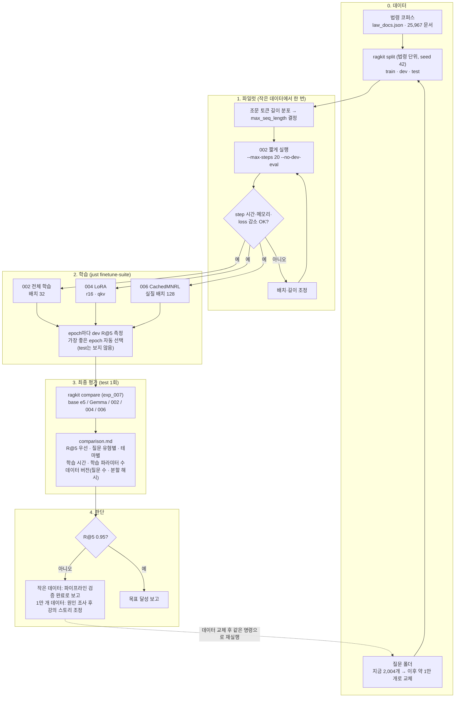

# 강의 계획: 임베딩 모델 파인튜닝

부제: AI 시대 생존법: 내 업무 확장편

> 이 저장소의 모든 자료(튜토리얼, 스크립트, 문서)는 이 흐름을 따른다.
> 새 작업을 시작하는 에이전트는 이 파일을 먼저 읽고, 만드는 것이 아래 4단계 중 어디에 속하는지 확인한다.
> 1단계는 `ragkit`(라이브러리), 2~4단계는 `apps/*`(ragkit을 쓰는 앱)에 만든다.

## 핵심 메시지

데이터 사이언티스트(DS)의 본업은 모델을 고르고, 학습하고, 평가하는 일이다.
예전에는 그 모델을 "쓸 수 있게" 만드는 일(API, 배포 최적화, 도구, 화면)은 다른 직군의 몫이거나, DS가 억지로 떠안는 부담이었다.
AI 코딩 도구가 오면서 DS 한 사람이 그 범위까지 직접, 빠르게 해낼 수 있게 됐다.
강의는 **같은 임베딩 모델 하나를 들고 DS의 업무 범위가 단계별로 넓어지는 과정**을 보여 준다.

```
[1. DS 본업]      모델 비교 → 학습 → 평가                  ragkit (src/ragkit/)
      ↓                                                      ▲ import
[2. +α 업무]      API로 감싸서 남이 쓰게 하기             apps/api
      ↓  ── AI가 오면서 ──
[3. 배포 최적화]  ONNX 변환 · 양자화 · 속도/정확도 비교   ragkit(변환) + apps/bench(비교)
      ↓
[4. 제품화]       CLI 도구 · MCP · React 프론트엔드        apps/search-cli, apps/mcp(제안), apps/web
```

주제 도메인은 대한민국 법령 조문 검색이다(데이터 결정은 `docs/handoff-law-question-gen.md` 참고).

## 교시 구성 (2026-09-30 확정)

8교시. 교시마다 50분 수업 + 10분 휴식(2026-10-01 결정). 교시마다 **그 시간에 하는 업무를 설명하는 장표 1개 + 그 업무를 직접 실행하는 스크립트**가 짝이다.
실습은 "2026년의 내가 하는 업무를 같이 해 본다"는 설정이고, 코드를 한 줄씩 보기보다 모델 개발 + 배포의 전체 과제 흐름을 수행해 보는 것이 목적이다.
실습 장표에는 그 업무의 2022년 모습과 2026년 모습을 한 줄씩 넣는다.

| 교시 | 구분 | 업무 / 내용 |
|---|---|---|
| 1 | 이론 | 내 소개: DS가 하는 일, AI 도입 전후(2022 vs 2026)의 현업 변화 |
| 2 | 이론 | 기술 용어·개념(ML/DL, 임베딩, 파인튜닝, 백엔드/API, CLI, MCP, 프론트엔드) → 강의 의도(왜 임베딩 파인튜닝인가) → 필요성(검색 누락이 RAG 정확도 상한, 쿼리 확장은 질문마다 LLM 비용) → 주제(법령이 적절한 사례인 이유: 일상어 vs 법률 용어, 통째로 못 넣는 코퍼스) → 실습 지도(실습 0~5) |
| 3 | 실습 0 | 환경 설정 + 완성품 먼저 써 보기(웹·CLI·MCP, base vs 파인튜닝 결과 나란히) + RAG 비교로 필요성 확인 |
| | **2022의 업무** | **DS 본업: 모델을 만든다** |
| 4 | 실습 1 | 데이터 만들기: 코퍼스, 질문 생성(Claude 스킬 — "같은 일도 방식이 바뀌었다"의 예), 법령 단위 분할 |
| 5 | 실습 2 | 평가: 평가셋과 지표 → **학습 없이 쓸 수 있는 선택지 비교**: 베이스 모델 비교(실험 005) + LLM 쿼리 확장(실험 003, 질문당 LLM 비용) → "학습해야 하는가"의 근거 |
| 6 | 실습 3 | 학습 실험과 분석: **DS 관점의 실험 iteration**(가설 → 설정 → 파일럿 → 학습 → dev로 선택 → test 1회 → 분석 → 다음 가설)과 **결과 분석**(실험 간 비교, 질문 유형·테마별, 실패 사례, 파인튜닝의 한계)에 초점. 학습 원리(MNRL, NO_DUPLICATES, hard negative, 전체 vs LoRA)는 짧게. 학습은 몇 step 맛보기만, 강사가 학습한 모델을 나눠 준다. **AI 시대에 더 쉽게 하는 방법**(AI에게 실험 설정·분석 스크립트·실패 사례 분류·리포트를 맡기고 DS는 가설과 판단에 집중, MLflow로 실험 비교) |
| | **2026의 업무** | **확장: 모델을 전달한다** |
| 7 | 실습 4 | 서빙과 배포 최적화: API는 수강생이 이미 배웠으므로 짧게 복습 → ONNX, INT8, 어휘 가지치기, 비교표 |
| 8 | 실습 5 | 제품화(CLI·MCP·웹), 마무리(다시 2022 vs 2026) |

실습 2 비교표 (학습 없이 쓸 수 있는 선택지. 실험 003 `experiments/exp_003_llm_query_expansion`):

| 조합 | 지표 | 질문당 LLM 호출 |
|---|---|---|
| e5 base | R@k, MRR, nDCG | 0 |
| e5 base + 쿼리 확장 | | 1 |

실습 3 비교표 (실험 010 `experiments/exp_010_lecture_comparison`, test R@5): 학습 전 e5 0.513 / 002 전체 학습 0.669 / 004 LoRA 0.641 / 006 배치 128 0.659 / 001 다시 캔 오답 3개 0.723 (`runs/001_hard_negatives`). 실습 2 표의 쿼리 확장 행을 옆에 두고 "파인튜닝은 질문당 LLM 비용을 학습 1회로 옮긴다"를 확인한다. EmbeddingGemma는 강의에서 뺐다(2026-10-06). 젬마가 든 실험 005·007은 기록으로만 남긴다.

운영 원칙: 무거운 산출물(모델, 파인튜닝 모델, 인덱스, 질문, split, 확장 쿼리 캐시)은 미리 만들어 Drive로 배포하고, 스크립트는 "받은 산출물로 확인" 모드와 "작은 부분집합으로 직접 실행" 모드를 둔다.

### 다음 작업 (2026-10-06)

1. ~~파인튜닝 재학습~~ — 완료(2026-10-01, 실험 007). 이어서 다시 캔 오답으로 0.723(실험 001, 2026-10-03)
2. 쿼리 확장 평가 — 코드 완료(`ragkit expand`, `evaluate --expand`, 실험 003 설정). gemini-2.5-flash-lite 무료 등급은 하루 20회라 실행 보류(2026-09-30), 캐시 17/2,526. 데이터 확보는 사용자 결정으로 미룸(2026-10-01). 실습 2 자료는 확장 행을 비워 두고 만든다
3. ~~위 두 비교표 채우기~~ — 실습 3 표는 완료(실험 010). 실습 2 표는 쿼리 확장 행만 남음
4. 교시 기준으로 `lecture/` 재구성 (`docs/HANDSON_PLAN.md`). 폴더 이름은 `tutorials` → `lecture`로 바꿨다(2026-10-01). 장표는 1~8교시 모두 claude.ai Slides 덱으로 만들었다(목록은 `lecture/README.md`). 스크립트는 교시 폴더 8개(`lecture/01_introduction` ~ `08_product`)로 재배치하고 실습 0~3 스크립트를 새로 썼다(2026-10-06)
5. 0.95 개선 계획 3단계(손실 함수)부터 — `runs/002_model_soup` 진행 중

## 저장소 구조

경계 기준: 모델·데이터를 **만드는** 것은 ragkit, 만든 것을 **쓰는** 것은 apps.

```
pyproject.toml         # 루트 = ragkit 패키지 + uv workspace (members = apps/api, apps/bench, apps/search-cli, apps/mcp)
src/ragkit/            # 1단계. data · training · evaluation · embeddings · retrieval · rag · export-onnx · 양자화 변환
apps/
  api/                 # 2단계. FastAPI 검색 API (ragkit + fastapi)
  bench/               # 3단계. 원본 / ONNX / 양자화 모델 비교표
  search-cli/          # 4단계. 최종 사용자용 검색 CLI (ragkit core만, uvx 배포)
  mcp/                 # 4단계. MCP 서버 (Claude 등 에이전트가 조문 검색)
  web/                 # 4단계. NotebookLM형 React 웹앱 '법령 노트' (Node 프로젝트, workspace 멤버 아님, apps/api만 호출)
experiments/           # 코드 없음. 실험별 config.yaml + 결과
lecture/               # 강의 자료. 실습 스크립트(ragkit과 apps를 호출만 한다) + slides/(HTML 슬라이드)
  01_introduction/ … 08_product/  # 폴더 하나 = 교시 하나 (1~8교시), 규칙은 lecture/README.md
scripts/               # 일회성 데이터 준비 (prepare_law_data, 질문 Drive 업로드·다운로드, 모델 다운로드)
```

- apps는 ragkit의 **공개 함수만** 쓴다(모델 로드, embed, 인덱스 생성·로드, search, evaluate_retrieval). 내부 모듈을 import하지 않는다.
- `ragkit` CLI(split / train / evaluate / export-onnx)는 DS용 도구라 ragkit에 둔다. 4단계 CLI는 최종 사용자용이라 별도 앱이다.
- 설치: 강의는 `uv sync --all-packages --all-extras`, 앱 실행은 `uv run --package <앱> ...`.
- 패키지 이름: `ragkit`(CLI `ragkit`), `ragkit-api`, `ragkit-bench`, `ragkit-search`(진입점 `ragkit-search`), `ragkit-mcp`.
- 의존성: ragkit core는 onnxruntime + tokenizers(배포 기본 ONNX), torch/transformers는 extra `[torch]`, 학습용은 extra `[train]`.

## 단계별 내용

### 1단계. DS 본업: 모델 비교, 학습, 평가 (ragkit)

기존 DS로서 해 왔던 일. 강의의 기준점이다.

- 도입(왜 파인튜닝인가): 코퍼스(약 700만 자)는 LLM에 통째로 넣을 수 없다 → 에이전트형 탐색 vs 임베딩 RAG → 검색에서 놓친 조문은 답할 수 없으니 검색 누락이 정확도 상한이 된다 → 쿼리 확장으로 메우면 쿼리마다 LLM 비용이 늘어 주객이 바뀐다 → 파인튜닝으로 그 비용을 학습 1회로 옮긴다
  - 학습 데이터 생성: 운영이라면 저가 API, 개발은 SKILL.md, 강의에서는 skill 약식으로 한다
  - 비교 실습: 순수 LLM / RAG / RAG+쿼리 확장
- 베이스 모델: 파인튜닝 대상 `intfloat/multilingual-e5-small` 하나로 진행한다. 학습 전 성능이 출발점이다 (`docs/adr/001-model-selection.md`). EmbeddingGemma와의 비교(실험 005·007)는 2026-10-06 강의에서 뺐다
- 데이터 준비: legalize-kr 법령 코퍼스 (`scripts/prepare_law_data.py`, 긴 조문은 항·호 단위로 나눠 약 2.6만 문서), Claude 스킬로 질문·정답 조문·hard negative 생성 (`.claude/skills/law-question-gen/`, 실습 폴더 `lecture/01_data/README.md`는 스킬 사용법만 안내), 질문 공유는 `scripts/law_questions_drive.py`
- 분할: 법령 단위(확정). 테마마다 법령 ~20%는 test, ~10%는 dev. 학습 때 본 적 없는 법령에서도 좋아지는지 측정
- 파인튜닝: 전체 학습(`exp_002_finetuned`)과 LoRA(`exp_004_lora`)를 따로 실험. MNRL + `BatchSamplers.NO_DUPLICATES`, e5 접두어는 코드에서 붙인다
- 평가: 전체 코퍼스 대상 Recall@k, MRR, nDCG로 base / 전체 학습 / LoRA (필요하면 쿼리 확장도) 비교
- 만능 아님: 추론, 수치 필터, 코퍼스에 없는 지식은 파인튜닝으로 고쳐지지 않는다
- 관련 위치: `ragkit.data`, `ragkit.training`, `ragkit.evaluation`, `ragkit` CLI, `experiments/`

#### 학습 실험 시나리오 (2026-09-29 합의)

목표: test **R@5 0.95** (주요 지표 R@5). 학습 질문은 약 1만 개로 늘릴 예정이다. 그 전에 지금의 작은 데이터로 모든 실험을 끝까지 돌려 파이프라인을 검증하고, 데이터가 준비되면 **데이터만 바꿔 같은 명령으로 재현**한다. 0.95 달성 여부는 1만 개 데이터 결과로 판단한다.
- 실행 경과(2026-09-30): 실행 시점에 질문 생성이 끝나 있어서(12,232개) 작은 데이터 단계는 건너뛰고 바로 전체 데이터로 돌렸다. 결과는 아래 "학습 실험 결과"에 있다.

출발점(작은 데이터, 측정값):
- 코퍼스 25,967 문서, 질문 2,004개(situation 955 · question 647 · keyword 402, 법령 14개, youth 테마가 1,791개)
- 법령 단위 분할: train 1,414개(법령 6개) · dev 181개(3개) · test 409개(5개, 학습 때 본 적 없는 법령)
- 기준선 test R@5: e5-small 0.526, EmbeddingGemma 0.817 (`experiments/exp_005_base_model_comparison`)

실험 (모두 e5-small, 같은 분할, seed 42):

| 실험 | 내용 | 비교해서 보는 것 |
|---|---|---|
| `exp_002_finetuned` | 전체 학습, 배치 32, hard negative 1개 | base e5 → 002 → Gemma: 작은 모델 + 파인튜닝이 큰 모델을 따라잡는가 |
| `exp_004_lora` | 002와 같고 LoRA(r16, query/key/value) | 학습 파라미터를 줄여도 002를 얼마나 따라가는가 |
| `exp_006_cached_mnrl` | 002와 같고 배치 128 | MNRL에서 배치 크기(in-batch negative 수)의 효과 |
| `exp_007_finetune_comparison` | 학습 없음. base e5 / Gemma / 002 / 004 / 006을 test로 비교 | 최종 비교표 |

공통 학습 설정(파일럿으로 정함, 2026-09-30):
- 손실은 세 실험 모두 CachedMNRL(mini-batch 16)이다. MNRL과 손실·기울기가 같고 메모리만 줄인다. M4 Pro 24GB에서 MNRL 배치 32(길이 512)는 메모리가 부족했다(질문 1개당 약 0.8GiB).
- attention dropout 0: MPS의 sdpa 커널은 dropout을 지원하지 않는다. 0으로 두면 eager 대비 약 25% 빠르고 메모리는 약 40% 적다. hidden dropout(0.1)은 그대로 둔다.
- max_seq_length 512: 학습 positive의 33%가 256 토큰을 넘고, 512를 넘는 것은 0.2%다.
- epoch는 최대 3이고, epoch마다 dev R@5를 재서 가장 좋은 epoch를 저장한다.
- 속도(작은 데이터): 배치 32에서 step당 약 2.5초, 1 epoch(45 step) 약 2분



원칙:
- 재현: `just finetune-suite <질문 폴더>` 한 명령이 split → 학습 3개 → 비교표를 모두 만든다. 사람이 고르는 단계(epoch 등)를 두지 않는다.
- test는 최종 비교에만 쓴다. epoch 선택은 dev R@5로만 한다. 그래야 "처음 보는 법령에서의 성능"이라고 말할 수 있다.
- 결과에는 데이터 버전(질문 수, 분할 파일 해시)을 적어, 어떤 데이터로 낸 숫자인지 표만 보고 알 수 있게 한다.
- 커밋: 코드, 설정, 비교표 `comparison.md`. 모델 가중치(`models/finetuned/`)는 커밋하지 않는다.
- 범위 밖: 수강생 실습용 축소판, 학습·평가 튜토리얼, `data/questions_test/` 정리(용도 확인 필요), 다른 손실 함수 비교

#### 학습 실험 결과 (2026-10-01)

데이터: 질문 12,232개, 법령 단위 분할 train 8,294(법령 29개) · dev 1,412(9개) · test 2,526(16개). 6개 테마가 모두 들어 있다. 실행 `just finetune-suite`, 1시간 59분.

test 결과(`experiments/exp_007_finetune_comparison/results/comparison.md`, 데이터 버전 `a0058b5ae8d9`). test는 이 한 번만 썼다:

| 모델 | R@5 | R@1 | R@10 | situation R@5 | 학습 시간 | 학습 파라미터 |
|---|---|---|---|---|---|---|
| base e5-small | 0.513 | 0.284 | 0.601 | 0.403 | - | - |
| EmbeddingGemma-300m | 0.743 | 0.462 | 0.817 | 0.685 | - | - |
| 002 전체 학습 (배치 32) | 0.669 | 0.405 | 0.757 | 0.589 | 40분 | 100% |
| 004 LoRA | 0.641 | 0.375 | 0.732 | 0.568 | 34분 | 0.4% |
| 006 전체 학습 (배치 128) | 0.659 | 0.392 | 0.751 | 0.582 | 35분 | 100% |

epoch별 dev R@5: 002는 0.694 / 0.700 / 0.702, 004는 0.670 / 0.684 / 0.688, 006은 0.676 / 0.698 / 0.699. 학습 전 base e5는 0.550이고, 세 실험 모두 epoch 3이 best였다.

읽은 것:
- 파인튜닝 효과: base e5 대비 test +0.156. 6개 테마와 3개 질문 유형 모두에서 올랐다.
- Gemma와의 차이: test에서 0.074가 남았다. dev(0.013)보다 훨씬 크다. dev는 지방세법 한 법령이 36%를 차지해 편중이 크므로, 모델 비교는 test 또는 법령별 평균으로 본다. dev R@5의 표준오차는 약 ±0.012이니 0.02 미만의 차이는 의미 없음으로 본다.
- 포화: dev 향상의 대부분이 epoch 1에서 나온다. train loss는 3.08에서 0.34까지 내려가는데, train 질문으로 코퍼스 전체를 검색한 R@5도 0.79에 그친다. loss는 배치 안 후보 중 고르기를 잴 뿐이라, 실제 과제(2.6만 문서 검색)를 배우기에는 negative가 너무 쉽다.
- LoRA: 파라미터 0.4%로 전체 학습의 96%(0.641 대 0.669)다.
- 배치 128: 효과가 없다(0.659 대 0.669). 무작위 in-batch negative를 늘려도 대부분 다른 법령의 쉬운 문서다. 필요한 것은 negative의 수가 아니라 난이도다.
- 강의 스토리: "작은 모델 + 파인튜닝이 큰 모델을 따라잡는가"에 대한 지금의 답은 "절반쯤 따라간다"다.

error analysis(2026-10-01, dev만 사용, agent 4개: 정량 분해 · 라벨 품질 · 검색 파이프라인 · 학습 전략):
- 오답이 몰린 곳(002 dev 오답 421개 기준):
  - 질문과 조문의 어휘 겹침이 적은 구어체 질문이 65%다. 겹침 사분위별 R@5는 0.46 / 0.67 / 0.81 / 0.88이다.
  - 지방세법이 40%다. train의 다른 세법과 헷갈린다.
  - 같은 법의 법률과 시행령을 혼동하는 경우가 25%다. 시행령 R@5는 0.657이다.
  - 할부거래법(0.46)처럼 100위 밖으로 크게 놓치는 법령이 있다.
  - 청크 분할, 정의 조항, 질문 길이는 주원인이 아니다.
- 1위 오답의 종류: 다른 법령 문서가 51%, 같은 법 다른 조문이 45%다. 학습에 준 hard negative가 1위인 경우는 5.5%뿐이다. 지금의 hard negative(같은 법 1~2개)는 실제로 헷갈리는 대상을 거의 담지 못한다.
- 라벨: dev 오답 100건을 판정한 결과 80%가 실제 검색 오류이고, 라벨 오류는 0건이다. 다만 정답이 하나라는 가정(`related_ids`가 전부 비어 있음) 때문에, 복수 정답(다른 문서의 완전한 답, 같은 조의 다른 조각, 법률과 시행령의 위임 관계)을 인정하면 002가 약 0.76(0.74~0.79)이 된다. train hard negative 중 실제 정답은 2.2%(부분답 포함 8.9%)로 병목이 아니다.
- 법령 차이: 파인튜닝 이득이 본 법령에서 +0.27, 처음 보는 법령에서 +0.15다. 이득의 절반쯤은 새 법령으로 옮겨가지 않는다.
- 검색 파이프라인 측정(dev, 융합 가중치는 2-fold CV):

| 설정 | R@5 | R@20 | R@100 |
|---|---|---|---|
| BM25 단독 (글자 2-gram, 제목 2배) | 0.552 | 0.712 | 0.857 |
| 002 + BM25 (z-score 융합) | 0.758 | 0.875 | 0.958 |
| Gemma + 002 (z-score 융합) | 0.795 | 0.897 | 0.967 |
| Gemma + 002 + BM25 | **0.814** | 0.913 | 0.969 |
| 위 조합 + bge-reranker-v2-m3 top-20 (200문항 표본) | 약 0.84 | | |
| 정답 법령을 알 때 (오라클) | 0.943 | 0.988 | 1.000 |

  - 융합은 z-score 방식이 RRF보다 1.5~2pt 낫다.
  - reranker는 CPU에서 질문당 약 2.8초다.
  - top-20을 다시 정렬하는 것만으로는 이론상 0.91이 한계다.
  - 남은 오류의 대부분은 "엉뚱한 법령의 비슷한 조문"이다.
- 분석 자료(저장소 밖): scratchpad `analysis/{slicing,label_quality,pipeline,training}/`

#### 0.95 개선 계획 (2026-10-01 확정)

제약(강사 결정):
- **2026-10-06: EmbeddingGemma는 강의에서 뺀다. 강의는 e5로만 진행한다.** 이 PC(M4 Pro 24GB)에서 Gemma를 학습하면 메모리가 22.5GiB까지 올라 한계에 가깝고, 1 epoch에 3시간 이상 걸린다(측정). 이전 기록의 Gemma 수치는 이력으로만 남긴다. 참고로 test에서 e5 001 A는 0.723, Gemma는 0.743이었다(강사 요청으로 1회 확인, `runs/ledger.tsv`).
- 모델은 multilingual-e5-small(118M) 하나다. 학습할 때도 다른 모델(Gemma, e5-base/large, cross-encoder)은 쓰지 않는다. e5-base(278M)와 e5-large(560M)는 EmbeddingGemma(308M)와 크기가 비슷하거나 더 커서 쓸 이유가 없다.
- reranker, BM25 하이브리드, 법령 분류 헤드, 위임 링크 점수 전달은 쓰지 않는다. 최종 시스템은 e5-small 단독 dense 검색이다.
- 판정 작업(hard negative 확인, 복수 정답, 합성 질문 정답 확인)은 Claude가 직접 한다. 결과는 질문별로 확인할 수 있는 파일로 남긴다.
- 단계마다 dev로 판단하고, test는 마지막에 한 번만 쓴다. dev 표준오차가 약 ±0.012이므로 0.02 미만의 차이는 의미 없음으로 보고, 법령별 평균도 함께 본다.

전제: reranker 없이 구어체 질문으로 조문을 찾는 과제에서 문헌상 최고치는 R@5 0.78(JuriFindIT, 이탈리아 조문 23k)이다. 0.95는 전례가 없다. 근거 있는 수단을 효과가 큰 순서로 쌓고, 단계마다 얼마나 오르는지 확인한다.

| 단계 | 내용 | 근거 | 통과 기준 (dev R@5) |
|---|---|---|---|
| 0. 평가 정비 | 위임 관계(법률↔시행령)와 같은 조의 다른 조각 등 복수 정답 후보를 구조(정규식, 조 단위)로 찾고 Claude가 판정한다. 모델의 검색 결과로 후보를 고르지 않아 test에도 같은 기준을 적용할 수 있다. 비교표에 법령별 평균을 추가한다 | dev 오답 100건 판정 결과 약 20%가 실제로 맞는 답 | 완료(2026-10-01, 실험 008): 대체 정답이 생긴 질문은 44개(3.1%)뿐이다. dev 복수 정답 R@5는 002 0.712(+0.01), base e5 0.562, Gemma 0.724. 이후 모델 선택은 복수 정답 R@5와 법령 평균으로 한다 |
| 1. 수렴 확인 | 002와 같게 두고 epoch 6, lr 3e-5(mE5 공식 small 레시피)로 학습한다(실험 009). epoch마다 dev 복수 정답 R@5와 train 질문 800개의 코퍼스 전체 검색 R@5를 본다. 002는 학습률이 선형으로 0까지 줄어 평평해진 것이 수렴인지 구분되지 않았다 | 004·006은 epoch 3까지 오르고 있었다 | 완료(2026-10-02): dev 복수 정답 R@5는 epoch별로 0.691 / 0.695 / 0.705 / **0.721** / 0.712 / 0.706이고, train 표본은 0.778에서 0.934까지 계속 올랐다. dev는 epoch 4가 정점이고 이후 과적합된다. 002(0.712)와의 차이 +0.009는 오차 범위 안이므로 덜 학습된 것이 아니다. 병목은 학습 신호(negative)와 데이터다. 이후 기본 설정은 lr 3e-5, 최대 epoch 4다. 학습 84분 |
| 2. hard negative 재채굴 | 002로 코퍼스 전체에서 후보 30개를 뽑는다 → 정답 점수의 95%를 넘는 후보는 걸러 낸다 → 애매한 후보는 Claude가 판정한다(실제 정답이면 복수 정답으로 돌린다) → 인접 법령과 법률↔시행령 대응 조문을 포함해 negative 5~7개를 넣는다 → 새 모델로 2~3라운드 반복한다 | NV-Retriever +4.5pt, RocketQA(거르지 않으면 하락), ANCE·Conan +2~3pt | 완료(2026-10-03, `runs/001_hard_negatives`): exp_009로 train 법령 문서에서 채굴한 negative 3개(정답 점수 95% 이상은 버림)가 dev 복수 정답 R@5 0.761이다. 같은 설정 대조군(seed 3개)은 0.720이다. 판정해서 남기기(B 0.756)와 negative 1개(C 0.751)도 개선이지만 A와 차이가 없다. hard negative 계열만으로는 상한이 약 0.90이다(31위 밖 실패 142개) |
| 3. 손실 함수 | GISTEmbed(guide = 파인튜닝한 e5-small 자신) 또는 어려운 샘플 가중(`hardness_mode`, 강도 5), scale 50~100, lr 3e-5 | 한국어 e5-small에서 일반 MNRL은 하락하고 GIST는 상승 / mE5 공식 레시피 | 2단계 대비 +0.01 이상 |
| 4. 합성 질문 | 코퍼스 전체 조문에 구어체 질문을 만든다(문체·화자 다양화). 생성은 강사가 하고, 생성 규칙과 누수 방지 기준은 Claude가 문서로 준다. 원문을 못 찾는 질문은 제거하고 정답은 Claude가 다시 판정한다 | Promptagator(110M이 6B를 이김), 러시아 법령 e5-small(구어체 +0.13), JuriFindIT(+8pt) | ≥ 0.82 |
| 5. 맥락 헤더 (마지막) | 조문 앞에 법령 종류, 장, (시행령이면) 위임한 모법 조문을 붙인다. "이 조항은 ~한 경우에 적용된다" 한 문장은 Claude가 쓴다. 재인덱싱만으로 효과를 먼저 재고, 같은 형식으로 재학습한다 | Contextual Retrieval: top-20 실패 −35~49% | 코퍼스를 바꾸므로 Gemma도 같이 좋아진다. 그래서 맨 마지막에 한다 |

- 예상(근거에 기반한 추정): 처음 보는 법령 기준 dev 0.73~0.78(0단계 결과로 0.02 낮춤), 코퍼스 전체에 합성 질문을 쓴 기준 0.78~0.83. BM25 하이브리드를 빼서 앞의 초안보다 약 0.05 낮다. 0.95는 4단계가 문헌보다 크게 효과를 낼 때만 가능하다.
- 효과가 없어 뺀 것: 점수 기반 법령 집계와 PRF(실측 +0.4pt 이하), 배치 키우기(실측 효과 없음), 질문 시점 LLM 재작성(문헌상 효과 없음), 더 큰 모델로 증류(제약)
- 결정 필요(4단계 전까지): 0.95의 기준이 (A) 처음 보는 법령에서의 성능인지, (B) 코퍼스 전체를 알고 학습한 상태(합성 질문)에서의 성능인지
- 리서치 근거(2026-10-01, agent 5개): 합성 질문, hard negative·손실 함수, 한국 법령 검색, 인덱스·법령 식별, e5 크기. 자료는 scratchpad `research/`에 있다(저장소 밖)

### 2단계. +α로 떠안던 일: API 개발 (apps/api)

모델을 만든 뒤 "그래서 어떻게 써요?"라는 요청에 답하려고 DS가 추가로 해야 했던 일.

- 1단계 모델을 검색 API로 감싸기: FastAPI `POST /search` → 상위 k개 조문 반환
- 요청/응답 스키마, 시작 시 모델·인덱스 로딩, 헬스체크
- 처음에는 torch 백엔드로 띄운다(3단계에서 ONNX로 바꾸는 전후를 비교하기 위해)
- 메시지: 예전에는 이 단계가 DS에게 낯설고 시간이 많이 드는 일이었다

### 3단계. AI가 오면서: 배포 최적화 (ragkit 변환 + apps/bench)

AI 도구 덕분에 DS가 직접 손대기 쉬워진 영역 ①.

- `ragkit export-onnx`로 PyTorch → ONNX 변환, 양자화(동적 INT8, 채널별)
- 어휘 가지치기(`ragkit prune-vocab`): 용량의 82%인 다국어 어휘 임베딩 표를 한국어 법령에 필요한 토큰(25만 → 약 1.9만)만 남긴다
- `apps/bench`: 원본 / ONNX / INT8 / 가지치기+INT8의 **지연 시간·메모리·모델 크기·설치 크기·검색 정확도(Recall@k)** 비교표
- `apps/api`의 백엔드를 torch → ONNX로 바꿔 설치 크기·시작 시간을 비교한다 (Docker는 쓰지 않는다)
- 메시지: "정확도를 얼마나 잃고 얼마나 빨라지는가"를 DS가 직접 재고 판단한다

### 4단계. AI가 오면서: CLI 도구, MCP, 프론트엔드 (apps/search-cli, apps/mcp, apps/web)

> MCP를 4단계에 두는 것은 제안이다(apps에 넣는 것은 확정).

AI 도구 덕분에 DS가 직접 손대기 쉬워진 영역 ②. 모델을 "제품"으로 전달한다.

- `apps/search-cli`: 동료가 설치해서 바로 쓰는 검색 도구 (cyclopts, `uvx`로 실행, ragkit core + ONNX만)
- `apps/mcp`: MCP 서버로 Claude 같은 에이전트가 조문을 검색하게 한다
- `apps/web`: NotebookLM형 '법령 노트'. 노트북 = 법령 묶음, 그 안에서 인용 달린 답을 스트리밍, 인용을 누르면 조문 원문, 답을 노트로 저장 (2단계 API만 호출). 스택: Vite + React + TS + Tailwind + shadcn/ui + TanStack Query (2026-09-29 확정)
- 네 앱 모두 ragkit의 `Searcher`(`ragkit.service`)를 입구로 쓴다 (구조는 `docs/ARCHITECTURE.md`)
- MLflow 3 모니터링 (`ragkit.tracking`, 2026-10-01): 실험 추적(train·evaluate·compare·bench run) → 모델 레지스트리(`ragkit register`, 앱은 `models:/law-embedder@champion`) → 서비스 트레이싱(질문 한 번 = 트레이스, 검색 조문·프롬프트·토큰, 노트북 = 세션)
- 메시지: DS 한 사람이 모델부터 사용자 화면까지 끝까지 만든다

## 진행 현황 (2026-10-06)

| 단계 | 소스 | 튜토리얼 | 확인 |
|---|---|---|---|
| 1 | ragkit(인덱스·분할·학습·평가·비교·오답 분석) | `03_setup` ~ `06_train` | 질문 12,232개 → 법령 단위 분할 train 8,294 · dev 1,412 · test 2,526(법령 16개). 실험 010(test R@5): 학습 전 e5 0.513 → 002 0.669 · 004 LoRA 0.641 · 006 0.659 · 001 다시 캔 오답 0.723. 쿼리 확장(실험 003)은 Gemini 한도로 보류. 실습 0~3 스크립트 완료(2026-10-06) |
| 2 | apps/api | `07_optimize/01_api_review.py` (실습 4 복습) | 실행 확인 (torch 백엔드, SSE, 노트북) |
| 3 | `ragkit quantize`(채널별 INT8), `ragkit prune-vocab`, apps/bench | `07_optimize/02`·`03` | 실험 008(test 2,526개): 가지치기+INT8이 torch 대비 설치 669→127MB·모델 471→30MB·메모리 1133→403MB·로딩 3.6→0.3s, R@5 0.513→0.515(동일). 가지치기 어휘가 test 질문 100%를 원본과 같게 토큰화 |
| 4 | apps/search-cli·mcp·web, `ragkit.tracking`(MLflow) | `08_product/01`~`04` | uvx(torch 없음), MCP stdio 도구 호출, 웹 흐름(Playwright) 확인. MLflow(`feat/mlflow`): bench run 2개 → 레지스트리 champion으로 API 기동 → 노트북 대화 2턴이 세션 하나의 트레이스 2개(검색 조문·토큰 수)로 남는 것 확인 |

- 이전 구성(Phase 1~4)의 자료는 모두 지웠다(2026-10-01). 옛 `tutorials/_legacy`(에이전트·모니터링)와 그것만 쓰던 `ragkit.monitoring`, `DocumentStore`·`retrieve`, `run_rag`, `config.EXPERIMENTS`까지 정리했다.

## 미정 사항

- (결정) 시간 배분은 위 "교시 구성"을 따르고, 교시마다 50분 수업 + 10분 휴식 (2026-10-01)
- (결정) RAG 에이전트는 지웠다 (2026-10-01). 2교시에 "에이전트형 탐색 vs 임베딩 RAG"를 한 줄로 넣고, 에이전트 흐름은 실습 5의 MCP가 보여 준다
- (결정) 옛 모니터링은 지우고 MLflow(실습 5)로 대체 (2026-10-01)
- (결정) 배포는 Docker 없이 `ragkit-api --web-dist apps/web/dist`(한 프로세스)로 한다 (2026-09-30)
